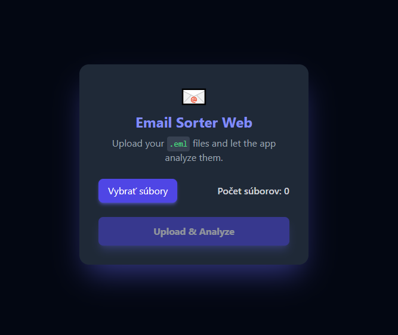
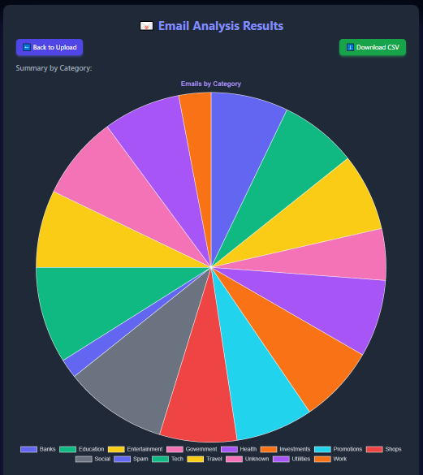
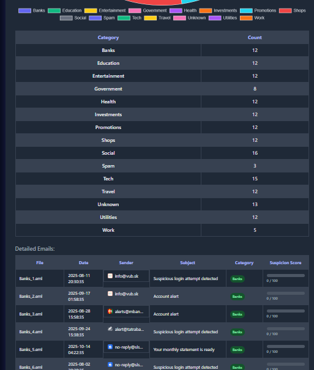
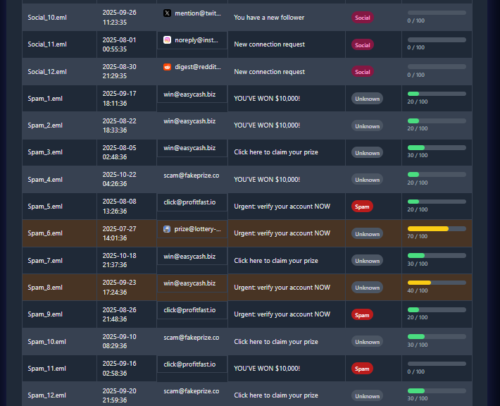

# 📧 Flask Email Sorter & Cyber Analysis Tool

## About The Project
This web application, built with **Flask (Python)**, is designed for the bulk analysis and categorization of email files in the `.eml` format. It provides a visual overview of your email archive, identifies potential spam and phishing threats, and categorizes messages based on their origin and content.

The frontend utilizes **Tailwind CSS** to achieve a modern, dark, and visually striking **"Cyberpunk"** aesthetic, making the data presentation engaging and professional.

## 🖼️ Visual Overview

This section showcases the application's modern, dark UI and its core functionalities.

### 1. Analysis Results (Detailed Table and Chart)
This screenshot displays the final analysis results, including the category chart and the detailed table with Suspicion Scores.


### 2. Upload Page (The Entry Point)
The clean, dark-themed upload interface for submitting multiple .eml files.


### 3. Category Breakdown (Pie Chart Visualization)
An example showing the interactive pie chart visualization for email category distribution.


### 4. Detailed Data View (Table and Scoring)
A view of the detailed data table featuring color-coded categories and the Suspicion Score progress bars.


---

## ✨ Key Features
* **Robust EML Parsing:** Handles the MIME structure to accurately extract metadata (Sender, Subject, Date) and email body content.
* **Intelligent Categorization:** Classifies emails into predefined categories (Banks, Shops, Social, Spam, etc.) based on sender domain and keywords found in the body.
* **Suspicion Scoring:** Calculates a real-time risk score (0-100) for each email, highlighting potential spam or phishing attempts with visual severity indicators.
* **Data Visualization:** Features an interactive pie chart (using **Chart.js**) to visualize category distribution.
* **Data Export:** Allows users to download the complete analysis data as a **CSV** file.
* **Stability (PRG):** Implements the Post-Redirect-Get (PRG) pattern for robust session management and error-free form submission handling.

---

## 🛠️ Technologies Used
* **Backend & Core Logic:** Python 3.x, Flask
* **Frontend Framework:** Tailwind CSS (via CDN)
* **Data Visualization:** Chart.js
* **Data Handling:** Python's built-in `email` module, CSV

---

## 🚀 Getting Started

Follow these steps to get the project up and running on your local machine.

### Prerequisites

You need Python 3.x installed and Git for cloning the repository.

### 1. Clone the Repository
Open your terminal or VS Code terminal:
```bash
git clone [https://github.com/adrianIT96/Flask-Email-Analyzer.git](https://github.com/adrianIT96/Flask-Email-Analyzer.git)
cd Flask-Email-Analyzer

### Set Up Virtual Environment (Recommended)

python -m venv venv
# Activate the environment:
# Windows (PowerShell):
.\venv\Scripts\activate
# Linux/macOS:
source venv/bin/activate

### Install Dependencies
pip install -r requirements.txt

### Run the Application
# For Linux/macOS
export FLASK_SECRET_KEY='your_strong_secret_key'
flask run

# For Windows (PowerShell)
$env:FLASK_SECRET_KEY='your_strong_secret_key'
flask run

The application will be available at: http://127.0.0.1:5000

📂 Project Structure
Flask-Email-Analyzer/
├── app.py              # Main Flask application, routing, and core logic
├── requirements.txt    # Python dependencies list
├── .gitignore          # Files ignored by Git (venv, uploads, cache)
└── templates/
    ├── index.html      # File upload page (Cyberpunk design)
    └── results.html    # Analysis results and charts page (Cyberpunk design)

👤 Author
Adrián Palička - linkedin.com/in/adrián-palička
